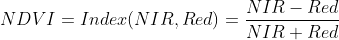
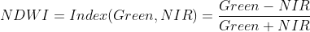
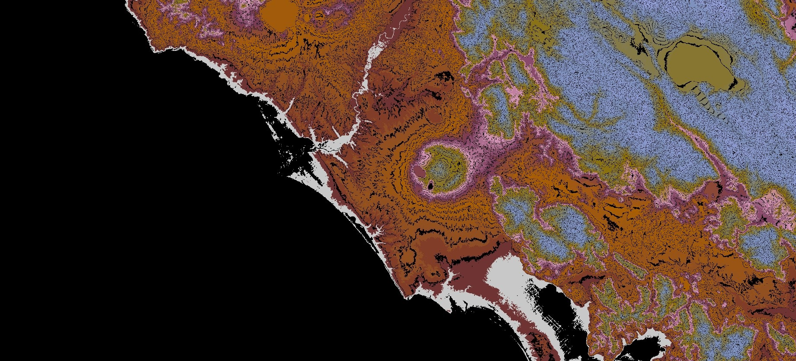

# Windy Sentinel Maps


## Windy POST Request

```bash
API_ENDPOINT = "https://api.windy.com/api/point-forecast/v2"

Key = 'Your API KEY'
```
## Tree Project

```bash
├── LICENSE
├── media
│   ├── doge.jpg
│   ├── good_boy.jpg
│   ├── ndvi_formula.gif
│   ├── ndvi.png
│   ├── ndwi_formula.gif
│   ├── ndwi.png
│   └── Sentinel-2-band-characteristics.png
├── README.md
├── sentinel
│   ├── ndvi
│   │   ├── eo_browser
│   │   │   └── ndvi.js
│   │   └── python
│   │       └── NDVI.ipynb
│   └── ndwi
│       └── ndwi.js
└── windy
    ├── Maps_html
    │   ├── index.html
    │   └── script.js
    └── Web Service
        ├── post_request.py
        └── text.json

```

## Usage

```bash
Usage: post_request.py [-h] --api_key API_KEY --lat LAT --lon LON --model MODEL [--output OUTPUT]

optional arguments:
  -h, --help         show this help message and exit
  --api_key API_KEY  Your API Keys
  --lat LAT          Latitude
  --lon LON          Longitude
  --model MODEL      Reference model
  --output OUTPUT    Define your output file name ex. output.json
```
## Sentinel-1, Sentinel-2, Sentinel-3


### Sentinel-1

The Sentinel-1 mission comprises a constellation of two polar-orbiting satellites, operating day and night performing C-band synthetic aperture radar imaging, enabling them to acquire imagery regardless of the weather.

Sentinel-1 will work in a pre-programmed operation mode to avoid conflicts and to produce a consistent long-term data archive built for applications based on long time series.

Sentinel-1 is the first of the five missions that ESA is developing for the Copernicus initiative.[1]

### Sentinel-2

#### Bands


The Copernicus Sentinel-2 mission comprises a constellation of two polar-orbiting satellites placed in the same sun-synchronous orbit, phased at 180° to each other. It aims at monitoring variability in land surface conditions, and its wide swath width (290 km) and high revisit time (10 days at the equator with one satellite, and 5 days with 2 satellites under cloud-free conditions which results in 2-3 days at mid-latitudes) will support monitoring of Earth's surface changes.

### Sentinel-3

The main objective of the Sentinel-3 mission is to measure sea surface topography, sea and land surface temperature, and ocean and land surface colour with high accuracy and reliability to support ocean forecasting systems, environmental monitoring and climate monitoring.

The Sentinel-3 Mission Guide provides a high-level description of the mission objectives, satellite description and ground segment. It also covers an introduction to heritage missions, thematic areas and services, orbit characteristics and coverage, instrument payloads and data products

### NDVI

The well known and widely used NDVI is a simple, but effective index for quantifying green vegetation. It normalizes green leaf scattering in Near Infra-red wavelengths with chlorophyll absorption in red wavelengths.

The value range of the NDVI is -1 to 1. Negative values of NDVI (values approaching -1) correspond to water. Values close to zero (-0.1 to 0.1) generally correspond to barren areas of rock, sand, or snow. Low, positive values represent shrub and grassland (approximately 0.2 to 0.4), while high values indicate temperate and tropical rainforests (values approaching 1). It is a good proxy for live green vegetation; see [4] for details.


|        Region:       | Sicily |
|:--------------------:|------------------------------------------------------------------|
|       Latitude:      | 37° 30' 0.0000'' N                                               |  
|      Longitude:      | 15° 5' 25.0008'' E                                               |  
|    Lat/Long (dec):   | 37.5, 15.090278                                                  |  
| Software used_:      | SNAP                                                             |  


#### Formula



### NDWI


|        Region:       | Adabozato, Isalo, Miandrivazo District, Menabe Region, Madagascar |
|:--------------------:|-------------------------------------------------------------------|
|       Latitude:      | 19° 43' 0" S                                                      |  
|      Longitude:      | 45° 22' 0" E                                                      |  
|    Lat/Long (dec):   | -19.71667,45.36667                                                |  
| Köppen climate type: | Aw : Tropical savanna, wet                                        |  
| Software used_:      | SNAP                                                             |  

The NDWI is used to monitor changes related to water content in water bodies. As water bodies strongly absorb light in visible to infrared electromagnetic spectrum, NDWI uses green and near infrared bands to highlight water bodies. It is sensitive to built-up land and can result in over-estimation of water bodies. The index was proposed by McFeeters, 1996.[5]

#### Formula


### DEM

A digital elevation model (DEM) is a 3D computer graphics representation of elevation data to represent terrain, commonly of a planet (e.g. Earth), moon, or asteroid. A "global DEM" refers to a discrete global grid. DEMs are used often in geographic information systems, and are the most common basis for digitally produced relief maps.[6]



|        Region:       |Rome, Italy |
|:--------------------:|-------------------------------------------------------------------|
|       Latitude:      | 41°54'39"24 N                                                     |  
|      Longitude:      | 12°28'54"48 E                                                 |  
|    Lat/Long (dec):   | 41,9109; 12,4818                                              |  
| Software used_:      | SentinelHub                                                       |  

Authors of the scripts for Sentinel Hub

* Peter Gabrovšek
* Marko Repše
* Monja Šebela

## References
|   |  Name | Link  |
|---|---|---|
|[1]| Sentinel-1  |https://sentinel.esa.int/web/sentinel/missions/sentinel-1   
|[2]| Sentinel-2  |https://sentinel.esa.int/web/sentinel/missions/sentinel-2
|[3]| Sentinel-3  |https://sentinel.esa.int/web/sentinel/missions/sentinel-3  
|[4]| NDVI  |Wikipedia, Normalized Difference Vegetation Index
|[5]| NDWI  |Wikipedia, Normalized Difference Water Index
|[6]| DEM   |Wikipedia, Digital elevation model
